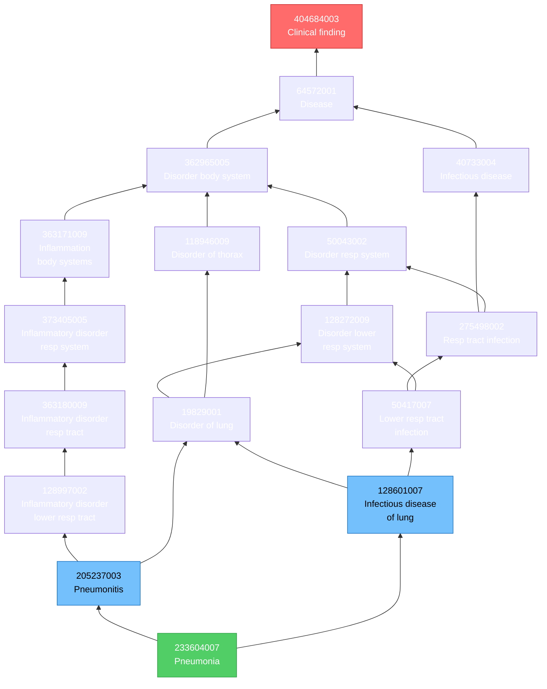

# Understanding SNOMED CT Transitive Closure

## Overview

A **transitive closure** is a pre-computed table that stores all ancestor-descendant relationships in a hierarchy. For SNOMED CT, it captures the complete chain of IS-A relationships for every concept.

### Why Do We Need It?

SNOMED CT is a polyhierarchical ontology - concepts can have multiple parents. Without transitive closure, finding all ancestors of a concept requires recursive queries, which are:

- **Slow** - Multiple database round-trips traversing the hierarchy
- **Complex** - Requires recursive CTEs or iterative loops
- **Resource-intensive** - High CPU/memory usage for deep hierarchies

The transitive closure table provides **instant lookups** for hierarchical queries.

## The Transitive Closure Table

In the DMWB_Export database, the transitive closure is stored in:

```
DMWB_NHS_SNOMED_Transitive_Closure_SCTTC
```

### Table Structure

| Column        | Description                                 |
| ------------- | ------------------------------------------- |
| `SupertypeID` | The ancestor concept (higher in hierarchy)  |
| `SubtypeID`   | The descendant concept (lower in hierarchy) |

The table contains **11,637,305 rows** representing every ancestor-descendant path in SNOMED CT.

### How It Works

For every concept A and concept B where A is an ancestor of B:

- There exists a row with `SupertypeID = A` and `SubtypeID = B`
- This includes direct parents AND all grandparents up to the root

**Example:** If the hierarchy is `Root → Disease → Lung Disease → Pneumonia`, the transitive closure stores:

| SupertypeID  | SubtypeID    |
| ------------ | ------------ |
| Root         | Disease      |
| Root         | Lung Disease |
| Root         | Pneumonia    |
| Disease      | Lung Disease |
| Disease      | Pneumonia    |
| Lung Disease | Pneumonia    |

### The Mathematics of Transitive Closure

Given a relation R (IS-A relationships), the transitive closure R⁺ is the smallest relation that:

1. Contains R (all direct relationships)
2. Is transitive: if (a,b) ∈ R⁺ and (b,c) ∈ R⁺, then (a,c) ∈ R⁺

For SNOMED CT with ~450,000 concepts and ~680,000 direct IS-A relationships, the transitive closure expands to **11.6 million** relationships.

---

## Working Example: Pneumonia (233604007)

Let's explore **Pneumonia** `233604007 |Pneumonia (disorder)|` using real SQL queries.

### Finding All Ancestors

To find all concepts that Pneumonia IS-A (all ancestors):

```sql
-- Find all ancestors of Pneumonia (233604007)
SELECT tc.SupertypeID, s.TERM
FROM DMWB_NHS_SNOMED_Transitive_Closure_SCTTC tc
JOIN DMWB_NHS_SNOMED_SCT s ON tc.SupertypeID = s.CUI
WHERE tc.SubtypeID = '233604007'
  AND tc.SupertypeID != '233604007'  -- Exclude self
  AND s.TYP = 3                       -- Preferred term only
ORDER BY s.TERM
```

**Results: Pneumonia has 28 ancestors:**

| SCTID     | Fully Specified Name                                          |
| --------- | ------------------------------------------------------------- |
| 404684003 | Clinical finding (finding)                                    |
| 64572001  | Disease (disorder)                                            |
| 362965005 | Disorder of body system (disorder)                            |
| 128272009 | Disorder of lower respiratory system (disorder)               |
| 19829001  | Disorder of lung (disorder)                                   |
| 50043002  | Disorder of respiratory system (disorder)                     |
| 609622007 | Disorder of thoracic segment of trunk (disorder)              |
| 118946009 | Disorder of thorax (disorder)                                 |
| 128121009 | Disorder of trunk (disorder)                                  |
| 298705000 | Finding of thoracic region (finding)                          |
| 302292003 | Finding of trunk structure (finding)                          |
| 609623002 | Finding of upper trunk (finding)                              |
| 40733004  | Infectious disease (disorder)                                 |
| 128601007 | Infectious disease of lung (disorder)                         |
| 363169009 | Inflammation of specific body organs (disorder)               |
| 363170005 | Inflammation of specific body structures or tissue (disorder) |
| 363171009 | Inflammation of specific body systems (disorder)              |
| 128139000 | Inflammatory disorder (disorder)                              |
| 128997002 | Inflammatory disorder of lower respiratory tract (disorder)   |
| 373405005 | Inflammatory disorder of the respiratory system (disorder)    |
| 363180009 | Inflammatory disorder of the respiratory tract (disorder)     |
| 301226008 | Lower respiratory tract finding (finding)                     |
| 50417007  | Lower respiratory tract infection (disorder)                  |
| 301230006 | Lung finding (finding)                                        |
| 205237003 | Pneumonitis (disorder)                                        |
| 106048009 | Respiratory finding (finding)                                 |
| 275498002 | Respiratory tract infection (disorder)                        |
| 406123005 | Viscus structure finding (finding)                            |

### Finding All Descendants

To find all types of Pneumonia (all descendants):

```sql
-- Find all subtypes of Pneumonia
SELECT tc.SubtypeID, s.TERM
FROM DMWB_NHS_SNOMED_Transitive_Closure_SCTTC tc
JOIN DMWB_NHS_SNOMED_SCT s ON tc.SubtypeID = s.CUI
WHERE tc.SupertypeID = '233604007'
  AND tc.SubtypeID != '233604007'  -- Exclude self
  AND s.TYP = 3                     -- Preferred term only
ORDER BY s.TERM
```

**Results: Pneumonia has 185 descendants, including:**

| SCTID          | Fully Specified Name                      |
| -------------- | ----------------------------------------- |
| 196112005      | Abscess of lung with pneumonia (disorder) |
| 61884008       | Achromobacter pneumonia (disorder)        |
| 195908008      | Actinomycotic pneumonia (disorder)        |
| 35031000119100 | Acute aspiration pneumonia (disorder)     |
| 123587001      | Acute bronchopneumonia (disorder)         |
| 58890000       | Adenoviral bronchopneumonia (disorder)    |
| 41207000       | Adenoviral pneumonia (disorder)           |
| 195902009      | Anthrax pneumonia (disorder)              |
| 422588002      | Aspiration pneumonia (disorder)           |
| 233606009      | Atypical pneumonia (disorder)             |
| ...            | *(185 total types of pneumonia)*          |

---

## Understanding Polyhierarchy

SNOMED CT allows concepts to have **multiple parents** (polyhierarchy). A single concept can belong to multiple classification categories simultaneously.

### Pneumonia's Multiple Inheritance Paths

Pneumonia has ancestors through **several distinct paths**:



### Why Multiple Paths Matter

Pneumonia can be reached through several classification paths:

1. **Anatomical**: Pneumonia → Disorder of lung → Disorder of thorax → Disorder of trunk
2. **Disease type**: Pneumonia → Disease → Clinical finding  
3. **Infectious**: Pneumonia → Infectious disease of lung → Infectious disease
4. **Inflammatory**: Pneumonia → Pneumonitis → Inflammatory disorder

When you query "show me all lung diseases", Pneumonia appears because it IS-A Disorder of lung.
When you query "show me all infectious diseases", Pneumonia also appears because it IS-A Infectious disease.

**The transitive closure captures ALL these paths in a single flat lookup table.**

---

## Common Use Cases

### 1. Subsumption Testing (Is A an ancestor of B?)

```sql
-- Is "Disease" an ancestor of "Pneumonia"?
SELECT CASE 
    WHEN EXISTS (
        SELECT 1 FROM DMWB_NHS_SNOMED_Transitive_Closure_SCTTC
        WHERE SupertypeID = '64572001'   -- Disease
          AND SubtypeID = '233604007'    -- Pneumonia
    ) THEN 'Yes - Pneumonia IS-A Disease' 
    ELSE 'No' 
END AS SubsumptionTest
```

**Result:** `Yes - Pneumonia IS-A Disease`

### 2. Find All Concepts in a Category

```sql
-- Find all respiratory infections (including pneumonia, bronchitis, etc.)
SELECT tc.SubtypeID, s.TERM
FROM DMWB_NHS_SNOMED_Transitive_Closure_SCTTC tc
JOIN DMWB_NHS_SNOMED_SCT s ON tc.SubtypeID = s.CUI
WHERE tc.SupertypeID = '275498002'  -- Respiratory tract infection
  AND s.TYP = 3
ORDER BY s.TERM
```

### 3. Expanding a Value Set

If a reference set includes "Pneumonia", you can expand it to include all subtypes:

```sql
-- Expand a value set to include all descendants
SELECT DISTINCT tc.SubtypeID AS ExpandedConcept
FROM MyValueSet vs
JOIN DMWB_NHS_SNOMED_Transitive_Closure_SCTTC tc 
    ON tc.SupertypeID = vs.ConceptID
```

### 4. Clinical Decision Support

```sql
-- Patient has "Bacterial pneumonia" - does this trigger "Infectious disease" alert?
DECLARE @PatientDiagnosis NVARCHAR(20) = '53084003'  -- Bacterial pneumonia

SELECT CASE 
    WHEN EXISTS (
        SELECT 1 FROM DMWB_NHS_SNOMED_Transitive_Closure_SCTTC
        WHERE SupertypeID = '40733004'        -- Infectious disease
          AND SubtypeID = @PatientDiagnosis
    ) THEN 'TRIGGER INFECTIOUS DISEASE ALERT'
    ELSE 'No action required'
END AS ClinicalAlert
```

### 5. Finding Common Ancestors

```sql
-- Find concepts that are ancestors of BOTH Pneumonia AND Asthma
SELECT tc1.SupertypeID, s.TERM
FROM DMWB_NHS_SNOMED_Transitive_Closure_SCTTC tc1
JOIN DMWB_NHS_SNOMED_Transitive_Closure_SCTTC tc2 
    ON tc1.SupertypeID = tc2.SupertypeID
JOIN DMWB_NHS_SNOMED_SCT s ON tc1.SupertypeID = s.CUI
WHERE tc1.SubtypeID = '233604007'  -- Pneumonia
  AND tc2.SubtypeID = '195967001'  -- Asthma
  AND s.TYP = 3
ORDER BY s.TERM
```

### 6. Counting Hierarchy Depth

```sql
-- How many levels deep is "Bacterial pneumonia" from "Clinical finding"?
-- This requires the original relationships, not just transitive closure
;WITH HierarchyPath AS (
    SELECT CUI, CUI2, 1 AS Level
    FROM DMWB_NHS_SNOMED_SCTREL
    WHERE CUI = '53084003' AND REL = '116680003'  -- Bacterial pneumonia IS-A
    
    UNION ALL
    
    SELECT r.CUI, r.CUI2, hp.Level + 1
    FROM HierarchyPath hp
    JOIN DMWB_NHS_SNOMED_SCTREL r ON r.CUI = hp.CUI2 AND r.REL = '116680003'
    WHERE hp.Level < 20
)
SELECT MAX(Level) AS ShortestPathToRoot
FROM HierarchyPath
WHERE CUI2 = '404684003'  -- Clinical finding
```

---

## Performance Comparison

### Without Transitive Closure (Recursive Query)

```sql
-- Slow: Recursive CTE to find all ancestors
;WITH RecursiveAncestors AS (
    -- Base case: direct parents
    SELECT CUI2 AS AncestorID, 1 AS Level
    FROM DMWB_NHS_SNOMED_SCTREL
    WHERE CUI = '233604007' AND REL = '116680003'
    
    UNION ALL
    
    -- Recursive case: grandparents and beyond
    SELECT r.CUI2, ra.Level + 1
    FROM RecursiveAncestors ra
    JOIN DMWB_NHS_SNOMED_SCTREL r ON r.CUI = ra.AncestorID AND r.REL = '116680003'
    WHERE ra.Level < 20
)
SELECT DISTINCT AncestorID FROM RecursiveAncestors
```

*Execution time: ~500-2000ms depending on hierarchy depth*

### With Transitive Closure (Direct Lookup)

```sql
-- Fast: Single table scan
SELECT SupertypeID AS AncestorID
FROM DMWB_NHS_SNOMED_Transitive_Closure_SCTTC
WHERE SubtypeID = '233604007'
```

*Execution time: ~5-20ms*

**Performance improvement: 50-100x faster**

---

## Table Statistics

| Metric                        | Value      |
| ----------------------------- | ---------- |
| Total rows                    | 11,637,305 |
| Unique SubtypeID values       | ~450,000   |
| Average ancestors per concept | ~26        |
| Maximum hierarchy depth       | ~15 levels |

---

## Related Tables in DMWB_Export

| Table                                      | Description                           |
| ------------------------------------------ | ------------------------------------- |
| `DMWB_NHS_SNOMED_SCT`                      | Concept descriptions (CUI, TERM, TYP) |
| `DMWB_NHS_SNOMED_SCTREL`                   | Direct relationships (CUI, REL, CUI2) |
| `DMWB_NHS_SNOMED_Transitive_Closure_SCTTC` | Transitive closure                    |

### TYP Values in SCT Table

| TYP | Description                      |
| --- | -------------------------------- |
| 0   | Synonym                          |
| 3   | Fully Specified Name (preferred) |

### REL Values in SCTREL Table

| REL         | Description     |
| ----------- | --------------- |
| 116680003   | IS-A            |
| (others)    | Attribute roles |

---

## Building Your Own Transitive Closure

If you need to generate transitive closure from scratch:

```sql
-- Create the transitive closure table
CREATE TABLE TransitiveClosure (
    SupertypeID VARCHAR(18) NOT NULL,
    SubtypeID VARCHAR(18) NOT NULL,
    PRIMARY KEY (SupertypeID, SubtypeID)
);

-- Iterative approach (more efficient than recursive CTE for large datasets)
-- Step 1: Insert direct relationships
INSERT INTO TransitiveClosure (SupertypeID, SubtypeID)
SELECT DISTINCT CUI2, CUI
FROM DMWB_NHS_SNOMED_SCTREL
WHERE REL = '116680003';  -- IS-A

-- Step 2: Iteratively add transitive relationships
DECLARE @RowsInserted INT = 1;
WHILE @RowsInserted > 0
BEGIN
    INSERT INTO TransitiveClosure (SupertypeID, SubtypeID)
    SELECT DISTINCT tc1.SupertypeID, tc2.SubtypeID
    FROM TransitiveClosure tc1
    JOIN TransitiveClosure tc2 ON tc1.SubtypeID = tc2.SupertypeID
    WHERE NOT EXISTS (
        SELECT 1 FROM TransitiveClosure existing
        WHERE existing.SupertypeID = tc1.SupertypeID 
          AND existing.SubtypeID = tc2.SubtypeID
    );
    SET @RowsInserted = @@ROWCOUNT;
END
```

**Note:** This is computationally expensive. The DMWB export provides a pre-computed table.

---

## Reflexive Transitive Closure

The DMWB table includes **reflexive** entries (each concept is an ancestor of itself):

```sql
-- Every concept has itself as an "ancestor"
SELECT COUNT(*) 
FROM DMWB_NHS_SNOMED_Transitive_Closure_SCTTC 
WHERE SupertypeID = SubtypeID
-- Returns: ~450,000 (one for each concept)
```

This simplifies queries where you want to include the concept itself:

```sql
-- Find Pneumonia and all its subtypes (including Pneumonia itself)
SELECT tc.SubtypeID, s.TERM
FROM DMWB_NHS_SNOMED_Transitive_Closure_SCTTC tc
JOIN DMWB_NHS_SNOMED_SCT s ON tc.SubtypeID = s.CUI
WHERE tc.SupertypeID = '233604007'  -- No need to UNION with Pneumonia itself
  AND s.TYP = 3
```

---

## Summary

| Aspect        | Transitive Closure    | Recursive Queries  |
| ------------- | --------------------- | ------------------ |
| Query Speed   | ⚡ Milliseconds        | 🐌 Seconds          |
| Storage       | 📦 ~1GB                | None extra         |
| Maintenance   | 🔄 Rebuild on release  | None               |
| Complexity    | ✅ Simple JOINs        | ⚠️ CTEs/loops      |
| Best For      | Production systems    | Ad-hoc exploration |

The transitive closure table is essential for any production SNOMED CT implementation where hierarchical queries need to be fast and reliable.

---

*Last updated: January 2026*
*Data source: DMWB_Export database (Data Migration Workbench)*
